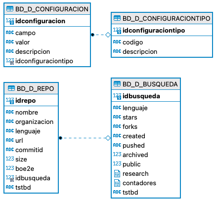

# BuscadorE2eGitHubRepos

Search for GitHub repositories based on a previously developed heuristic. 
The aim is to find GitHub repositories that may have end-to-end (e2e) tests.

## Set Up 📋

Pre-requisites to reproduce the work:

- Python 3.9
- Git 2.32+
- Docker 19+ or MySql Community Server 8+

Install Python libraries

```
$ pip install -r requirements.txt
```

Run local databse (MySQL) with Docker

```
docker run --name master-mysql -d -p 3306:3306 \
           -e MYSQL_ROOT_PASSWORD=password -e MYSQL_DATABASE=buscadorGitHubRepos \
           -v "$(pwd)"/init.sql:/docker-entrypoint-initdb.d/init.sql mysql:5.7
```

Run local databse (MySQL) with MySQL Community Server 8.X
1) Instalar MySQL Community Server 8.X: https://dev.mysql.com/downloads/mysql/
2) Mediante un terminal de comandos, acceder a la carpeta donde se haya instalado MySql (p.Ej: C:\Program Files\MySQL\MySQL Server 8.0\bin) y ejecutar el siguiente comando:

```
mysql -u root -p
```
3) Introducir contraseña establecida en la instalación de MySQL Community Server.
4) Una vez accedido a la consola de MySQL, ejecutar el fichero init.sql para inicializar la base de datos.

## Variables de configuración 🔧

- Actualizar BD: si se marca esta opción se actualizarán los datos relacionados con la búsqueda y con cada repositorio en base de datos. 
- Buscar repos en LOCAL: si se marca esta opción se clonan los proyectos que se van a utilizar en la carpeta “repositories”, y una vez clonados, la búsqueda se realiza sobre dichos ficheros en local. Al finalizar el proceso se borra la carpeta “repositories” y se genera un fichero zip a modo de snapshot con todos esos repositorios clonados inicialmente.
- Generar lista repos ('.pickle’): si se marca esta opción se genera un nuevo fichero “.pickle” con todos los repositorios que se van a utilizar en el proceso de búsqueda. Si no se marca se reutiliza el fichero “.pickle” existente en la carpeta del proyecto.
- Randomizar repositorios: si se marca esta opción, de todos los repositorios obtenidos inicialmente para realizar la búsqueda, se utilizan un número x de forma aleatoria.
- Clonar repositorios resultantes: si se marca esta opción se clonan en local los repositorios que hayan cumplido algún criterio.
- Generar excel: si se marca esta opción se guarda el resultado de la búsqueda en un fichero en formato excel.
- Generar Csv: si se marca esta opción se guarda el resultado de la búsqueda en un fichero en formato csv.
- Escribir en LOG: si se marca esta opción se escribirán ficheros de LOG relacionados con el análisis de cada repositorio al que se le aplica el heurístico.

<p>Pestaña 1:</p>


<p>Pestaña 2:</p>


<p>Pestaña 3:</p>


## Database diagram



## Construido con 🛠️

* [PyCharm Community](https://www.jetbrains.com/es-es/pycharm/?ref=hackernoon.com)

## Autores ✒️

* **Jorge Contreras Padilla** - [jorcontrerasp](https://github.com/jorcontrerasp)

## Licencia 📄

Este proyecto está bajo la Licencia (Apache-2.0 License) - mirar el archivo [LICENSE](https://github.com/jorcontrerasp/BuscadorE2eGitHubRepos/blob/main/LICENSE) para más detalles.
