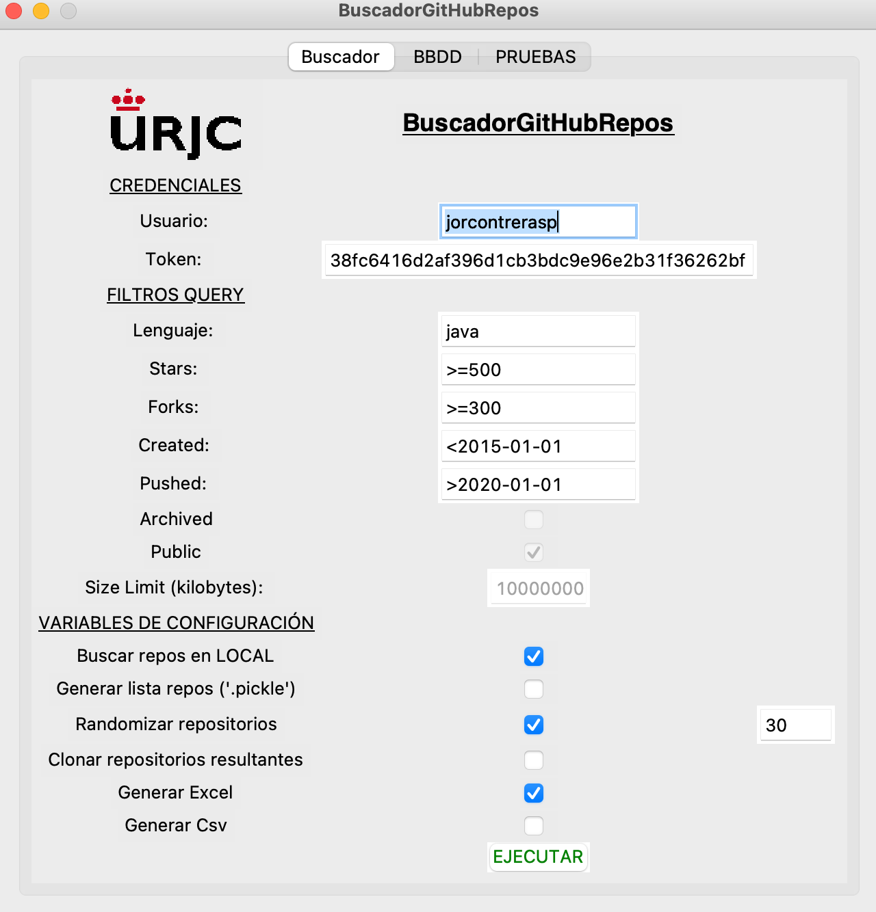
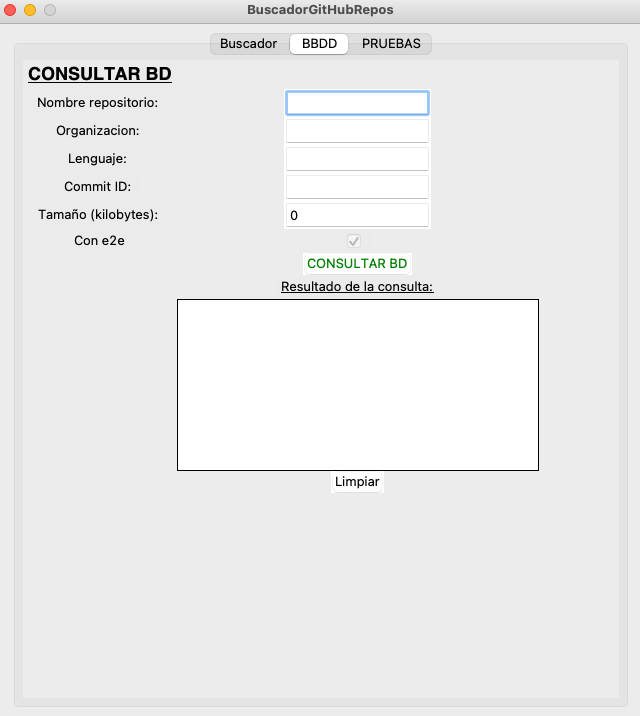
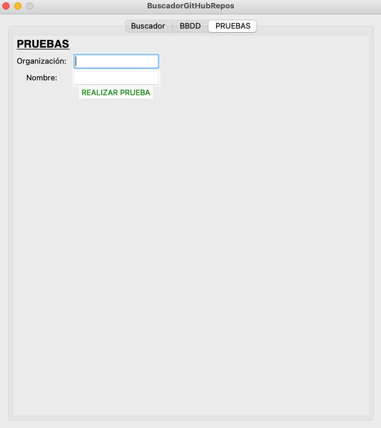

# BuscadorGitHubRepos

Buscador de repositorios GitHub en función de un heurístico desarrollado previamente. 
Se trata de encontrar repositorios de GitHub que puedan tener pruebas ent-to-end (e2e).

### Pre-requisitos 📋

pip install PyGithub

pip install pandas

pip install openpyxl

pip install pillow

xcode-select —install (para corregir un posible xcrun error)

pip install pymysql

### Variables de configuración 🔧

- Actualizar BD: si se marca esta opción se almacenarán los datos obtenidos en base de datos. Para ello se ha utilizado una BB MySql.

  
CONFIGURACIÓN DE LA BBDD:

  Mysql -u root -p

  CREATE DATABASE buscadorGitHubRepos;

  USE buscadorGitHubRepos;
  
  -- Script generador del esquema:
  
  DROP TABLE BD_D_REPO;
  
  DROP TABLE BD_D_BUSQUEDA;
  
  DROP TABLE BD_D_CONFIGURACION;
  
  DROP TABLE BD_D_CONFIGURACIONTIPO;

  CREATE TABLE IF NOT EXISTS BD_D_BUSQUEDA(idbusqueda int(11) NOT NULL AUTO_INCREMENT, 
  lenguaje varchar(50), 
  stars varchar(50), 
  forks varchar(50), 
  created varchar(100), 
  pushed varchar(100), 
  archived int(1), 
  public int(1), 
  research BLOB,
  contadores BLOB,
  tstbd varchar(100), 
  PRIMARY KEY (idbusqueda));

  INSERT INTO BD_D_BUSQUEDA (lenguaje, stars, forks, created, pushed, archived, public, tstbd) 
  VALUES ("PLenguaje", "pStars", "pForks", "pCreated", "pPushed", 0, 1, "pTstbd");

  CREATE TABLE IF NOT EXISTS BD_D_REPO(idrepo int(11) NOT NULL AUTO_INCREMENT, 
  nombre varchar(50), 
  organizacion varchar(200), 
  lenguaje varchar(50), 
  url varchar(1000), 
  commitid varchar(20), 
  size int(20), 
  boe2e int(1),
  idbusqueda int(11),
  tstbd varchar(100), 
  PRIMARY KEY (idrepo),
  INDEX (idbusqueda),
  FOREIGN KEY (idbusqueda) REFERENCES BD_D_BUSQUEDA(idbusqueda));

  INSERT INTO BD_D_REPO (nombre, organizacion, lenguaje, url, commitid, size, boe2e, tstbd) 
  VALUES("pNombre", "pOrganizacion", "pLenguaje", "pUrl", "123456789A", 1000, 0, "pTstbd");

  CREATE TABLE IF NOT EXISTS BD_D_CONFIGURACIONTIPO(idconfiguraciontipo int(11) NOT NULL AUTO_INCREMENT, 
  codigo varchar(50),
  descripcion varchar(500), 
  PRIMARY KEY (idconfiguraciontipo));

  INSERT INTO BD_D_CONFIGURACIONTIPO(codigo, descripcion)
  VALUES ("CREDENCIALES", "Configuración relativa a las credenciales de GitHub");

  INSERT INTO BD_D_CONFIGURACIONTIPO(codigo, descripcion)
  VALUES ("BD_CONF", "Configuración relativa a las conexiones a la BBDD");

  INSERT INTO BD_D_CONFIGURACIONTIPO(codigo, descripcion)
  VALUES ("SEARCH_PARAM", "Configuración relativa al funcionamiento del buscador");

  INSERT INTO BD_D_CONFIGURACIONTIPO(codigo, descripcion)
  VALUES ("FILTROS_PARAM", "Configuración inicial del filtro de búsqueda");

  CREATE TABLE IF NOT EXISTS BD_D_CONFIGURACION(idconfiguracion int(11) NOT NULL AUTO_INCREMENT,
  campo varchar(100),
  valor varchar(500),
  idconfiguraciontipo int(11),
  PRIMARY KEY (idconfiguracion),
  INDEX (idconfiguraciontipo),
  FOREIGN KEY (idconfiguraciontipo) REFERENCES BD_D_CONFIGURACIONTIPO(idconfiguraciontipo) );

  -- Configuración de las credenciales de GitHub
  INSERT INTO BD_D_CONFIGURACION(campo, valor, idconfiguraciontipo)
  VALUES("user", "jorcontrerasp", (SELECT IDCONFIGURACIONTIPO FROM BD_D_CONFIGURACIONTIPO WHERE CODIGO = 'CREDENCIALES'));

  INSERT INTO BD_D_CONFIGURACION(campo, valor, idconfiguraciontipo)
  VALUES("token", "fd761289fc2b65485d7ffe989e4c04b15fe8c69d", (SELECT IDCONFIGURACIONTIPO FROM BD_D_CONFIGURACIONTIPO WHERE CODIGO = 'CREDENCIALES'));

  -- Configuración que se utiliza para la BBDD (por tenerla almacenada en BD también)
  INSERT INTO BD_D_CONFIGURACION(campo, valor, idconfiguraciontipo)
  VALUES("host", "localhost", (SELECT IDCONFIGURACIONTIPO FROM BD_D_CONFIGURACIONTIPO WHERE CODIGO = 'BD_CONF'));

  INSERT INTO BD_D_CONFIGURACION(campo, valor, idconfiguraciontipo)
  VALUES("port", "3306", (SELECT IDCONFIGURACIONTIPO FROM BD_D_CONFIGURACIONTIPO WHERE CODIGO = 'BD_CONF'));

  INSERT INTO BD_D_CONFIGURACION(campo, valor, idconfiguraciontipo)
  VALUES("user", "root", (SELECT IDCONFIGURACIONTIPO FROM BD_D_CONFIGURACIONTIPO WHERE CODIGO = 'BD_CONF'));

  INSERT INTO BD_D_CONFIGURACION(campo, valor, idconfiguraciontipo)
  VALUES("password", "password", (SELECT IDCONFIGURACIONTIPO FROM BD_D_CONFIGURACIONTIPO WHERE CODIGO = 'BD_CONF'));

  INSERT INTO BD_D_CONFIGURACION(campo, valor, idconfiguraciontipo)
  VALUES("db", "buscadorGitHubRepos", (SELECT IDCONFIGURACIONTIPO FROM BD_D_CONFIGURACIONTIPO WHERE CODIGO = 'BD_CONF'));

  -- Configuración del filtro de búsqueda
  INSERT INTO BD_D_CONFIGURACION(campo, valor, idconfiguraciontipo)
  VALUES("language", "Java", (SELECT IDCONFIGURACIONTIPO FROM BD_D_CONFIGURACIONTIPO WHERE CODIGO = 'FILTROS_PARAM'));

  INSERT INTO BD_D_CONFIGURACION(campo, valor, idconfiguraciontipo)
  VALUES("stars", ">=500", (SELECT IDCONFIGURACIONTIPO FROM BD_D_CONFIGURACIONTIPO WHERE CODIGO = 'FILTROS_PARAM'));

  INSERT INTO BD_D_CONFIGURACION(campo, valor, idconfiguraciontipo)
  VALUES("forks", ">=300", (SELECT IDCONFIGURACIONTIPO FROM BD_D_CONFIGURACIONTIPO WHERE CODIGO = 'FILTROS_PARAM'));

  INSERT INTO BD_D_CONFIGURACION(campo, valor, idconfiguraciontipo)
  VALUES("created", "<2015-01-01", (SELECT IDCONFIGURACIONTIPO FROM BD_D_CONFIGURACIONTIPO WHERE CODIGO = 'FILTROS_PARAM'));

  INSERT INTO BD_D_CONFIGURACION(campo, valor, idconfiguraciontipo)
  VALUES("pushed", ">2020-01-01", (SELECT IDCONFIGURACIONTIPO FROM BD_D_CONFIGURACIONTIPO WHERE CODIGO = 'FILTROS_PARAM'));

  INSERT INTO BD_D_CONFIGURACION(campo, valor, idconfiguraciontipo)
  VALUES("pushed", ">2020-01-01", (SELECT IDCONFIGURACIONTIPO FROM BD_D_CONFIGURACIONTIPO WHERE CODIGO = 'FILTROS_PARAM'));

  INSERT INTO BD_D_CONFIGURACION(campo, valor, idconfiguraciontipo)
  VALUES("archived", "False", (SELECT IDCONFIGURACIONTIPO FROM BD_D_CONFIGURACIONTIPO WHERE CODIGO = 'FILTROS_PARAM'));

  INSERT INTO BD_D_CONFIGURACION(campo, valor, idconfiguraciontipo)
  VALUES("public", "True", (SELECT IDCONFIGURACIONTIPO FROM BD_D_CONFIGURACIONTIPO WHERE CODIGO = 'FILTROS_PARAM'));

  -- Configuración de los parámetros de búsqueda
  INSERT INTO BD_D_CONFIGURACION(campo, valor, idconfiguraciontipo)
  VALUES("buscarEnLocal", "True", (SELECT IDCONFIGURACIONTIPO FROM BD_D_CONFIGURACIONTIPO WHERE CODIGO = 'SEARCH_PARAM'));

  INSERT INTO BD_D_CONFIGURACION(campo, valor, idconfiguraciontipo)
  VALUES("generarListaRepos", "True", (SELECT IDCONFIGURACIONTIPO FROM BD_D_CONFIGURACIONTIPO WHERE CODIGO = 'SEARCH_PARAM'));

  INSERT INTO BD_D_CONFIGURACION(campo, valor, idconfiguraciontipo)
  VALUES("randomizarListaRepos", "True", (SELECT IDCONFIGURACIONTIPO FROM BD_D_CONFIGURACIONTIPO WHERE CODIGO = 'SEARCH_PARAM'));

  INSERT INTO BD_D_CONFIGURACION(campo, valor, idconfiguraciontipo)
  VALUES("lapseExe", "False", (SELECT IDCONFIGURACIONTIPO FROM BD_D_CONFIGURACIONTIPO WHERE CODIGO = 'SEARCH_PARAM'));

  INSERT INTO BD_D_CONFIGURACION(campo, valor, idconfiguraciontipo)
  VALUES("clonarRepositorios", "False", (SELECT IDCONFIGURACIONTIPO FROM BD_D_CONFIGURACIONTIPO WHERE CODIGO = 'SEARCH_PARAM'));

  INSERT INTO BD_D_CONFIGURACION(campo, valor, idconfiguraciontipo)
  VALUES("doExcel", "True", (SELECT IDCONFIGURACIONTIPO FROM BD_D_CONFIGURACIONTIPO WHERE CODIGO = 'SEARCH_PARAM'));

  INSERT INTO BD_D_CONFIGURACION(campo, valor, idconfiguraciontipo)
  VALUES("doCsv", "False", (SELECT IDCONFIGURACIONTIPO FROM BD_D_CONFIGURACIONTIPO WHERE CODIGO = 'SEARCH_PARAM'));

  INSERT INTO BD_D_CONFIGURACION(campo, valor, idconfiguraciontipo)
  VALUES("N_RANDOM", "30", (SELECT IDCONFIGURACIONTIPO FROM BD_D_CONFIGURACIONTIPO WHERE CODIGO = 'SEARCH_PARAM'));

  INSERT INTO BD_D_CONFIGURACION(campo, valor, idconfiguraciontipo)
  VALUES("N_LAPSE_REPOS", "20", (SELECT IDCONFIGURACIONTIPO FROM BD_D_CONFIGURACIONTIPO WHERE CODIGO = 'SEARCH_PARAM'));

  INSERT INTO BD_D_CONFIGURACION(campo, valor, idconfiguraciontipo)
  VALUES("REPO_SIZE_LIMIT", "10000000", (SELECT IDCONFIGURACIONTIPO FROM BD_D_CONFIGURACIONTIPO WHERE CODIGO = 'SEARCH_PARAM'));

  INSERT INTO BD_D_CONFIGURACION(campo, valor, idconfiguraciontipo)
  VALUES("actualizarBD", "True", (SELECT IDCONFIGURACIONTIPO FROM BD_D_CONFIGURACIONTIPO WHERE CODIGO = 'SEARCH_PARAM'));

  COMMIT;
  
  

- Actualiza BD: si se marca esta opción se actualizarán los datos relacionados con la búsqueda y con cada repositorio en base de datos. 
- Buscar repos en LOCAL: si se marca esta opción se clonan los proyectos que se van a utilizar en la carpeta “repositories”, y una vez clonados, la búsqueda se realiza sobre dichos ficheros en local. Al finalizar el proceso se borra la carpeta “repositories” y se genera un fichero zip a modo de snapshot con todos esos repositorios clonados inicialmente.
- Generar lista repos ('.pickle’): si se marca esta opción se genera un nuevo fichero “.pickle” con todos los repositorios que se van a utilizar en el proceso de búsqueda. Si no se marca se reutiliza el fichero “.pickle” existente en la carpeta del proyecto.
- Randomizar repositorios: si se marca esta opción, de todos los repositorios obtenidos inicialmente para realizar la búsqueda, se utilizan un número x de forma aleatoria.
- Clonar repositorios resultantes: si se marca esta opción se clonan en local los repositorios que hayan cumplido algún criterio.
- Generar excel: si se marca esta opción se guarda el resultado de la búsqueda en un fichero en formato excel.
- Generar Csv: si se marca esta opción se guarda el resultado de la búsqueda en un fichero en formato csv.

Pestaña 1:

Pestaña 2:

Pestaña 3:

## Construido con 🛠️

* [PyCharm Community](https://www.jetbrains.com/es-es/pycharm/?ref=hackernoon.com)

## Autores ✒️

* **Jorge Contreras Padilla** - [jorcontrerasp](https://github.com/jorcontrerasp)

## Licencia 📄

Este proyecto está bajo la Licencia (Apache-2.0 License) - mirar el archivo [LICENSE](https://github.com/jorcontrerasp/BuscadorGitHubRepos/blob/main/LICENSE) para más detalles.
